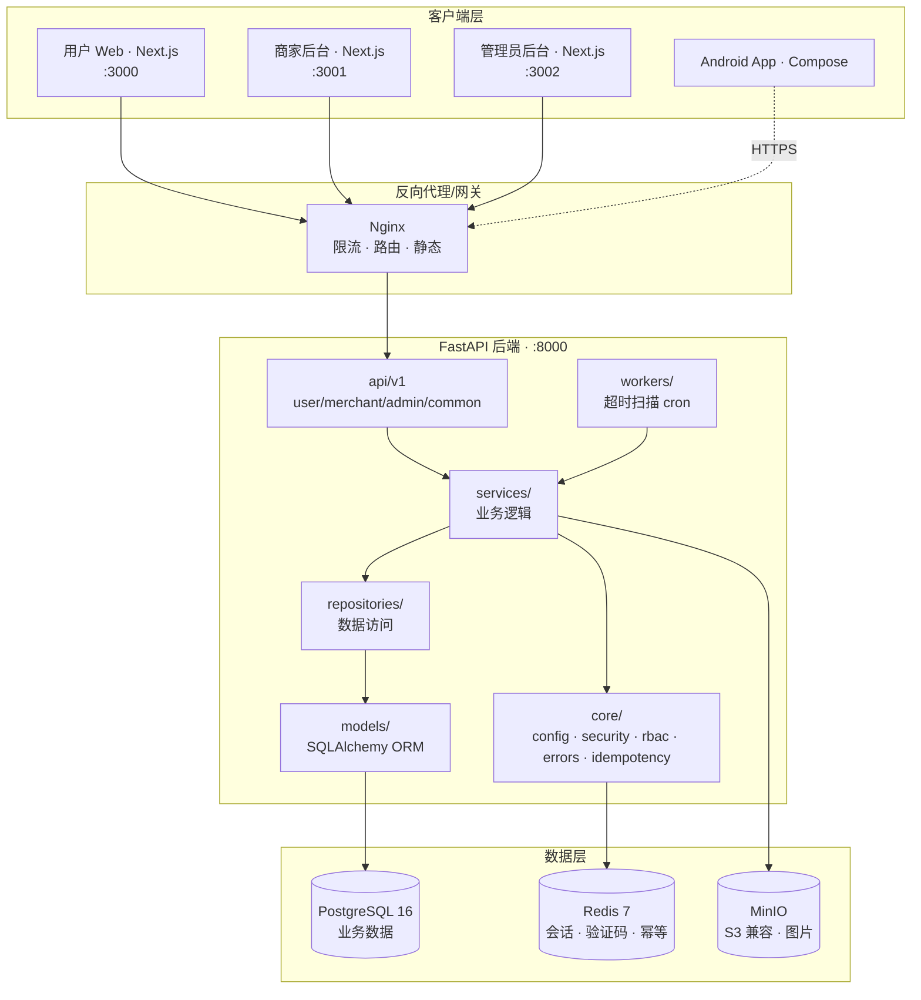
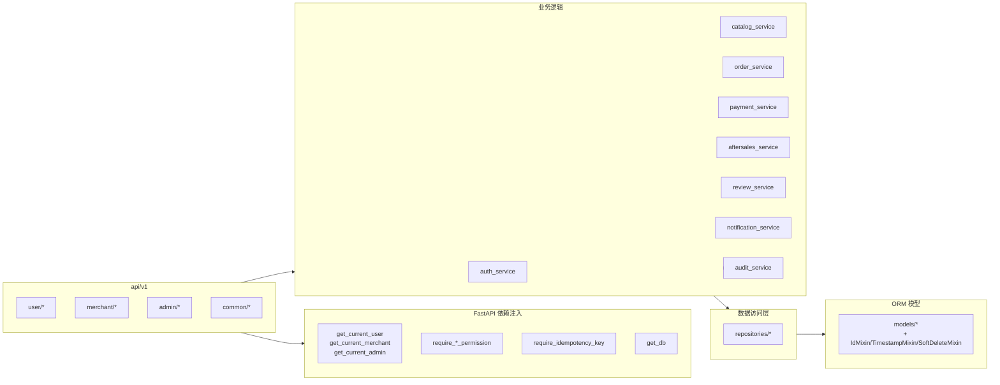
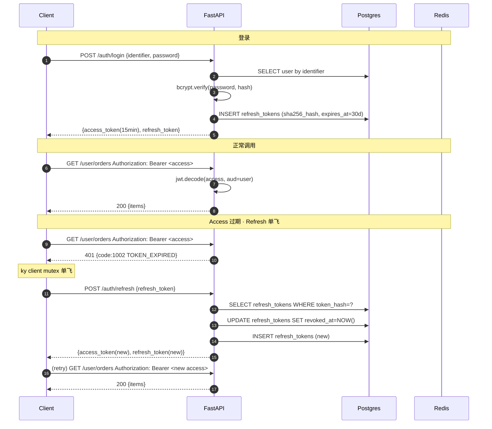
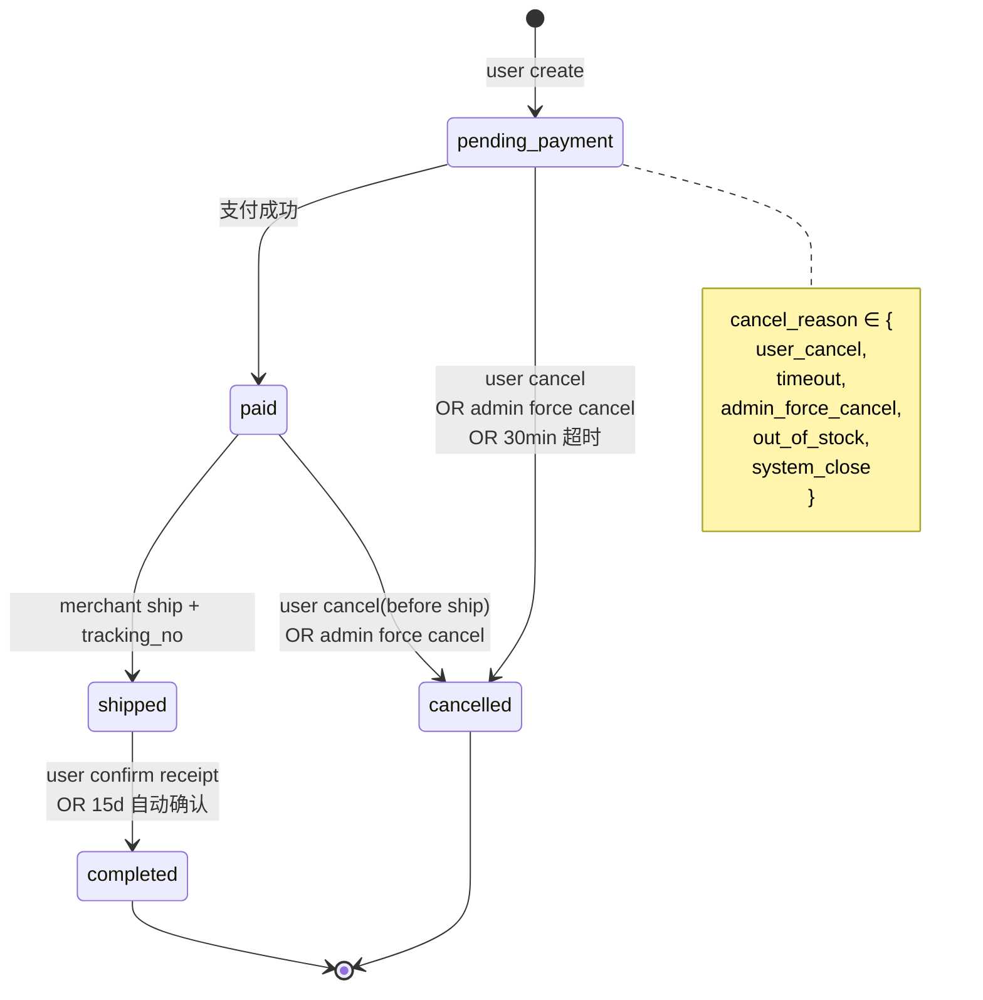
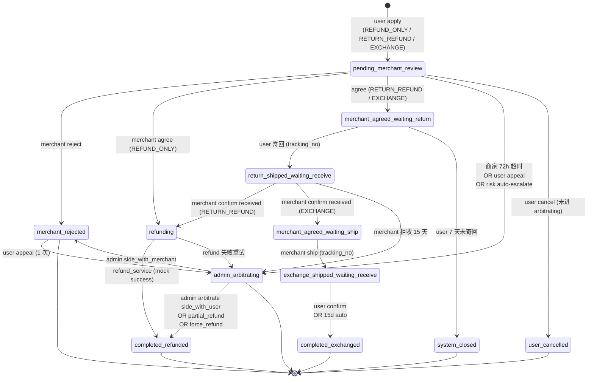
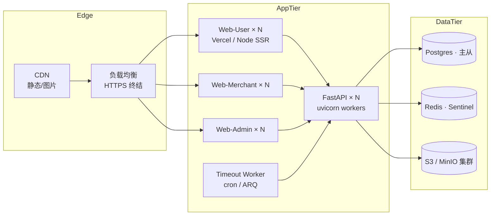

# 系统架构 · JD-Clone

> 本文档描述 JD-Clone 电商平台的整体架构、模块划分、部署拓扑与关键设计决策。
> 详细的 API 契约见 [docs/API/INDEX.md](API/INDEX.md)；开发流程与规范见 [AGENTS.md](../AGENTS.md)。
>
> 版本：v1.0 · 更新日期：2026-07-24

---

## 1. 项目概览

**JD-Clone** 是一个复刻京东（JD.com）业务生态的多端电商平台，覆盖 **用户 Web / Android / 商家后台 / 管理员后台** 四个客户端加一个 **FastAPI 后端**。核心理念是 **"做深做透"**：不追求功能数量，但每个模块必须覆盖三角色协作、状态机、异常流程与超时机制。项目按 Phase 0-7 迭代交付，最终打 `v1.0.0` 主版本 tag。

---

## 2. 技术栈总览

| 层级 | 技术 | 说明 |
|---|---|---|
| **前端 · 用户 Web** | Next.js 15 + React 19 + TypeScript strict + Tailwind CSS 4 | 端口 3000 · 主色 `#D0211A` |
| **前端 · 商家后台** | Next.js 15 + React 19 + Tailwind CSS 4 + Recharts | 端口 3001 · 主色 `#1a56db` |
| **前端 · 管理员后台** | Next.js 15 + React 19 + Tailwind CSS 4 | 端口 3002 · 主色 `#0f172a` |
| **前端共通** | Zustand + TanStack Query + ky + React Hook Form + Zod + Vitest | pnpm workspace |
| **Android App** | Kotlin 2.0 + Jetpack Compose (M3) + Hilt + Retrofit + OkHttp + Coil3 + DataStore | 消费者端，对接 Phase 1-5 后端 |
| **后端** | FastAPI 0.115 + SQLAlchemy 2.0 (async) + Alembic + PostgreSQL 16 + Redis 7 + MinIO | Python 3.12 · uv 依赖 |
| **认证** | JWT (HS256, 15 min access) + opaque refresh token (48-byte, SHA-256 hash 落库) | 三 audience：user / merchant / admin |
| **基础设施** | Docker Compose · GitHub Actions · Nginx（生产） · 5 marketplace 40+ plugins | monorepo |
| **测试** | pytest + pytest-asyncio + httpx（后端） · Vitest（三前端） · Playwright（E2E · Phase 7 引入） · Compose Test（Android） | — |

---

## 3. 系统架构图



---

## 4. 后端分层



**分层原则**（`AGENTS.md` §4）：
- `api/`：路由 + Schema 校验 + 依赖注入（认证 / 权限 / 幂等），**不写业务逻辑**
- `services/`：业务事务的最小闭环 — 状态机、库存联动、审计写入、事件发布
- `repositories/`：DB 查询封装（本项目 Phase 1-6 大部分直接在 service 内查询，未强制分离）
- `models/`：SQLAlchemy declarative + Enum + 复合索引 + partial UNIQUE
- `workers/`：cron 触发的批处理（超时扫描等），本 Phase 用脚本 + 外部 cron 触发，未接 ARQ / Celery

---

## 5. 认证时序图（JWT + Refresh 单飞）



**关键点**
- Access = 15 min HS256 JWT，携带 `aud=user|merchant|admin` 隔离三身份域
- Refresh = 48-byte opaque `secrets.token_urlsafe`，DB 只存 SHA-256 hex；每次 refresh **rotate**（旧 token 标 revoked）
- 客户端（ky / Retrofit AuthInterceptor）用 Mutex 保证并发请求命中同一次 refresh
- 密码变更 / reset-password / 主动登出 → revoke 所有该用户的 refresh token

---

## 6. 订单状态机（Phase 3）



- 触发主体：`user` / `merchant` / `admin` / `system`，均写 `order_status_history` + `audit_log`
- 库存联动：`paid` 锁库存（stock ↓ / locked_stock ↑）；`shipped` locked→sold；`cancelled` 全部释放
- 超时扫描：`app/scripts/process_timeouts.py`（30 min 未付 + 15 天未确认收货）

---

## 7. 售后状态机（Phase 4 · 12 态）



- **触发方**：`user` / `merchant` / `admin` / `system` — 每次转换均写 `aftersales_status_history` + `aftersales_messages`
- **凭证**：`aftersales_evidences` 按 6 stage 分类（apply / merchant_review / user_return / merchant_receive / admin_arbitration / user_appeal）
- **超时升级**：4 类（详见 `app/scripts/process_timeouts.py`）
- **风控**：30 天 3 单自动升级到 `admin_arbitrating`（`risk_service`）
- **平台仲裁**：3 outcome × 强制退款金额校验 × 结论 ≥20 字 × 二次勾选"不可撤销"

详细契约见 [phase-4-contracts.md](API/phase-4-contracts.md)。

---

## 8. 部署拓扑

### 8.1 本地开发（docker-compose）

```
┌─ postgres:16-alpine   :5432
├─ redis:7-alpine       :6379
├─ minio:latest         :9000 (API) · :9001 (Console)
├─ minio-init           初始化 jdclone-public / jdclone-private bucket
└─ backend (uvicorn)    :8000
```

前端不进 docker，本地 `pnpm dev:*` 起 3000/3001/3002。

### 8.2 生产建议拓扑（未部署）



**未做（Phase 7 明确不做）**：K8s manifest / Helm chart / 监控栈 / CDN 接入 / TLS 证书自动化 —— 属项目后期工作。

---

## 9. 关键设计决策（ADR-style 摘要）

| # | 决策 | 理由 | Phase |
|---|---|---|---|
| **ADR-1** | Monorepo（pnpm workspace + backend + android-app） | 联调便利、契约同步、CI 一次装 | 0 |
| **ADR-2** | JWT 分三个 `aud`（user/merchant/admin）而非 role claim | 域隔离，防止用户 token 误用为 admin；解码时强制指定 aud | 1 |
| **ADR-3** | Refresh token = opaque 随机串（非 JWT）+ SHA-256 hash 落库 | 服务端可以吊销；即便 DB 泄露也不可反推明文 | 1 |
| **ADR-4** | RBAC 硬编码 Permission StrEnum + role→set 映射 | 契约层面清晰可 diff；避免 DB 权限爆炸；后期可迁移 | 1 |
| **ADR-5** | 状态机 + 状态历史表（`order_status_history` / `aftersales_status_history`） | 时间轴可视化 + 审计溯源；业务时间轴与 audit_log 互补 | 3 / 4 |
| **ADR-6** | Idempotency-Key 强制 + DB UNIQUE 兜底 | 客户端重试 / 网络抖动不产生重复订单 / 退款；前端 sessionStorage 持久 | 3 / 4 |
| **ADR-7** | `session.begin_nested()` SAVEPOINT 包裹 order_no 冲突重试 | UNIQUE 冲突不破外层事务；避免整个下单流程回滚 | 3 |
| **ADR-8** | Partial UNIQUE index 只在 Alembic 里 `op.execute` 声明，不在 SQLAlchemy 模型层 | SQLite `create_all` 会退化为全表 UNIQUE，破坏测试 | 3 |
| **ADR-9** | 图片上传走 MinIO Presigned URL（前端直传） | 减轻后端流量；aioboto3 生成 15 min TTL 的 PUT URL | 2 |
| **ADR-10** | 订单 items 冗余 SPU/SKU 快照字段 | 商家改价 / 下架不影响历史订单展示与售后追溯 | 3 |
| **ADR-11** | 售后凭证按 6 stage 分类存储 | 支持 4 角色不同视角查看不同 stage 证据；仲裁时集中呈现 | 4 |
| **ADR-12** | 站内信事件驱动写入 | 售后 approve / 评价新增 / 举报处理等业务事件自动 fanout；解耦 | 5 |
| **ADR-13** | Android 单 agent 全权交付 + SendMessage 续跑 | 多 agent 并行改 NavHost/ApiService 冲突高；单 agent 减少集成成本 | 6 |
| **ADR-14** | 手机号 admin 端明文 / user & merchant 端 `138****1234` 脱敏 | 平台仲裁需要联系用户；用户/商家端保护隐私 | 3 / 4 |

---

## 10. 更多参考

- API 契约索引：[docs/API/INDEX.md](API/INDEX.md)
- Phase 划分与里程碑：[docs/DEVELOPMENT_PLAN.md](DEVELOPMENT_PLAN.md)
- 变更日志：[docs/CHANGELOG.md](CHANGELOG.md)
- 安全审查：[docs/SECURITY_AUDIT.md](SECURITY_AUDIT.md)
- 协作者上手：[docs/CONTRIBUTING.md](CONTRIBUTING.md)
- Multi-Agent 协作规范：[AGENTS.md](../AGENTS.md)
